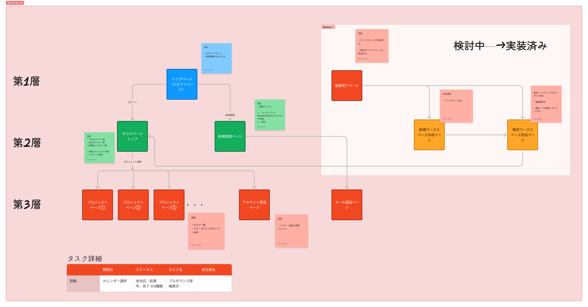

# アプリ名：タスクマネージャー

チーム内の進捗管理を「スプレッドシートの入力漏れ」から解放するための、リアルタイムタスク管理アプリです。

## 🚀 開発の背景と目的
現在のプロジェクト現場において、基本的に業務管理がスプレッドシートやワード、エクセルによるものでして、その入力の規格や更新規定が緩く、厳格なタスク管理が把握できていないといった課題を感じていました。
サブリーダーとしての経験から、「現場の管理コストを最小化し、開発に集中できる環境を作りたい」と考え、自走してこのアプリを開発・導入しました。

## ✨ 主な機能

| 機能 | 説明 |
|------|------|
| タスク・Wiki管理 | CRUD操作で柔軟にタスクとプロジェクトドキュメントを管理 |
| 複数ビュー対応 | カレンダー・テーブル・ボード表示で、ユーザーの見たい形式を選択可能 |
| ユーザー認証 | 安全なログイン・登録・パスワード管理 |
| チャット機能 | アプリ内でタスク状態について共有が可能 |
| AI質問機能 | Gemini APIとの連携で、AIが質問に回答 |
| 通知機能 | タスク更新や期限間近の情報をリアルタイムで通知 |

## 🛠 使用技術 (Tech Stack)

| レイヤー | 技術 |
|---------|------|
| **Frontend** | Next.js 13 (App Router), React, TypeScript |
| **Backend / DB** | Supabase (PostgreSQL)、リアルタイムリスナー |
| **AI連携** | Gemini API |
| **Deployment** | Vercel |
| **Authentication** | Supabase Auth |
| **Testing** | Jest, React Testing Library |

## 💡 技術的なこだわり・工夫した点

- 状態管理と再レンダリングの最適化
  - Next.js App Router + React Server Components を活用し、必要なコンポーネントだけをクライアントに配信。
  - `useMemo`, `useCallback`, `Suspense` を適切に使って、タスク一覧やチャットがスムーズに表示されるように設計。

- Supabase を中心としたリアルタイム同期
  - リアルタイムリスナーでタスク/コメント/通知の更新を即座に反映。
  - 認証は Supabase Auth、DB は PostgreSQL を利用。セッション管理とアクセス制御をシンプルに実装。

- UI/UXの工夫
  - タスクをカレンダー・テーブル・ボードで切り替え可能にし、ユーザーの使い方に応じた柔軟な視認性を確保。
  - チャット形式でタスクの状態を共有できるように設計。
  - モーダルやプルダウンでの操作を最小クリックで完了できるようにインタラクション設計。

- AI連携・情報補完
  - Gemini API との連携で、チャット形式で質問に答える機能を実装し、情報収集の手間を削減。

- テスト・品質担保
  - Jest + React Testing Library で画面操作とAPIフローの単体テストをカバー。

## 📸 サイトマップ

